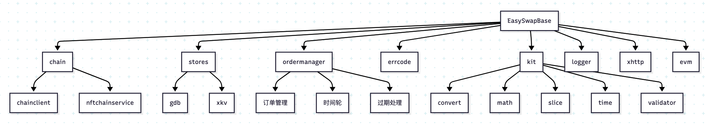

我来为你分析EasySwapBase工程的功能流程。这是一个基础库工程，主要提供区块链交互、数据存储等核心功能。让我按照功能模块分类展示：

### 1. 区块链交互模块(chain)
```go
// chain/chainclient/evmclient/service.go
type Service struct {
    client *ethclient.Client
}
```
主要功能：
- 连接以太坊节点
- 过滤链上日志事件
- 获取区块信息
- 调用智能合约

### 2. 数据存储模块(stores)
```go
// stores/gdb/gdb.go
const (
    OrderBookDexProject = "OrderBookDex"
)
```
包含两个子模块：
- gdb：基于GORM的数据库操作
- xkv：基于Redis的缓存操作

### 3. 订单管理模块(ordermanager)
```go
// ordermanager/service.go
type OrderManager struct {
    chain string
    TimeWheel [WheelSize]wheel
    CurrentIndex int64
    collectionOrders map[string]*collectionTradeInfo
    collectionListedCh chan string
}
```
核心功能：
- 订单生命周期管理
- 时间轮处理订单
- 集合订单统计
- 过期订单处理

### 4. 错误处理模块(errcode)
```go
// errcode/errcode.go
type Error struct {
    Code int
    Message string
}
```
提供统一的错误处理机制

### 5. 工具模块(kit)
包含多个子工具：
- convert：数据类型转换
- math：数学计算
- slice：切片操作
- time：时间处理
- validator：数据验证

### 6. 日志模块(logger)
```go
// logger/xzap/zaplogger.go
type ZapLogger struct {
    logger *zap.Logger
}
```
提供统一的日志记录功能

### 7. HTTP客户端模块(xhttp)
```go
// xhttp/client.go
type Client struct {
    client *http.Client
}
```
提供HTTP请求功能

### 8. EVM相关模块(evm)
```go
// evm/erc/erc721/nfterc721.go
type ERC721 interface {
    // ERC721标准接口
}
```
包含：
- EIP标准实现
- ERC标准接口
- 地址处理

### 功能流程图



这个架构设计遵循了模块化原则，每个模块职责明确，便于维护和扩展。核心功能围绕区块链交互和数据管理展开，为上层应用提供基础服务支持。