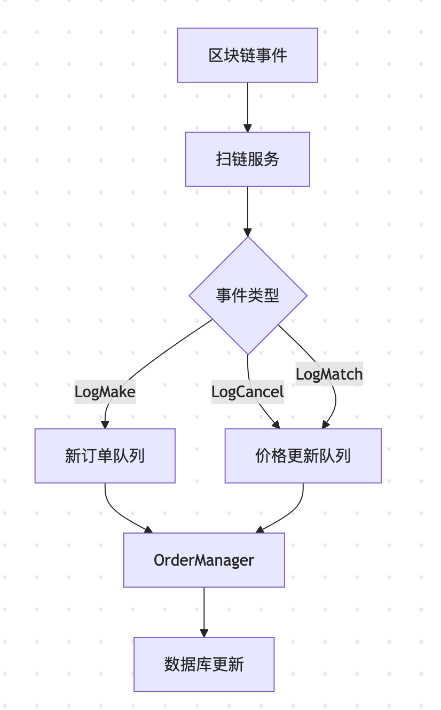

- [链事件与队列消息关系分析](#链事件与队列消息关系分析)
	- [1. 整体关系图](#1-整体关系图)
	- [2. 事件类型与队列关系](#2-事件类型与队列关系)
		- [2.1 LogMake（新订单事件）](#21-logmake新订单事件)
		- [2.2 LogCancel（取消订单事件）](#22-logcancel取消订单事件)
		- [2.3 LogMatch（成交事件）](#23-logmatch成交事件)
	- [3. 队列处理流程](#3-队列处理流程)
		- [3.1 监听事件](#31-监听事件)
		- [3.2 OrderManager队列处理](#32-ordermanager队列处理)
		- [3.3 价格更新队列处理](#33-价格更新队列处理)
	- [4. 关键事件类型](#4-关键事件类型)
	- [5. 数据流转路径](#5-数据流转路径)
	- [6. 关键特性](#6-关键特性)

# 链事件与队列消息关系分析

> 订单管理系统与扫链日志事件是生产者-消费者关系：
> - 扫链服务作为生产者，监听区块链事件
> - OrderManager作为消费者，处理订单相关事件

## 1. 整体关系图



## 2. 事件类型与队列关系

### 2.1 LogMake（新订单事件）
```go
// 扫链服务处理
func (s *Service) handleMakeEvent(log ethereumTypes.Log) {
    // 1. 解析订单数据
    // 2. 存入数据库
    // 3. 添加到订单管理队列
    s.orderManager.AddToOrderManagerQueue(&multi.Order{
        ExpireTime:        newOrder.ExpireTime,
        OrderID:           newOrder.OrderID,
        CollectionAddress: newOrder.CollectionAddress,
        TokenId:           newOrder.TokenId,
        Price:             newOrder.Price,
        Maker:             newOrder.Maker,
    })
}
```

### 2.2 LogCancel（取消订单事件）
```go
// 扫链服务处理
// 取消订单事件处理
func (s *Service) handleCancelEvent(log ethereumTypes.Log) {
    // 1. 更新订单状态
    s.db.Table(multi.OrderTableName(s.chain)).
        Where("order_id = ?", orderId).
        Update("order_status", multi.OrderStatusCancelled)
    
    // 2. 通知OrderManager
    ordermanager.AddUpdatePriceEvent(s.kv, &ordermanager.TradeEvent{
        OrderId:        cancelOrder.OrderID,
        CollectionAddr: cancelOrder.CollectionAddress,
        EventType:      ordermanager.Cancel,
    }, s.chain)
}

```

### 2.3 LogMatch（成交事件）
```go
// 扫链服务处理
func (s *Service) handleMatchEvent(log ethereumTypes.Log) {
    // 1. 更新订单状态
    // 2. 添加到价格更新队列
    ordermanager.AddUpdatePriceEvent(s.kv, &ordermanager.TradeEvent{
        OrderId:        sellOrderId,
        CollectionAddr: collection,
        EventType:      ordermanager.Buy,
        TokenID:        tokenId,
        From:           from,
        To:             to,
    }, s.chain)
}
```

## 3. 队列处理流程
### 3.1 监听事件

```go
// EasySwapBase/ordermanager/service.go
func (om *OrderManager) Start() {
    threading.GoSafe(om.ListenNewListingLoop)  // 监听新订单
    threading.GoSafe(om.orderExpiryProcess)    // 处理过期订单
    threading.GoSafe(om.floorPriceProcess)     // 更新地板价
    threading.GoSafe(om.listCountProcess)      // 统计订单数量
}

```

### 3.2 OrderManager队列处理
```go
func (om *OrderManager) ListenNewListingLoop() {
    for {
        // // 从Redis队列获取事件
        result, err := om.Xkv.Lpop(key)
        if err != nil {
            continue
        }
        
        // 处理订单事件
        om.handleOrderEvent(result)
    }
}
```

### 3.3 价格更新队列处理
```go
func (om *OrderManager) floorPriceProcess() {
    for {
        // 从队列获取价格更新事件
        event := <-om.collectionListedCh
        
        // 更新地板价
        om.updateFloorPrice(event)
    }
}
```

## 4. 关键事件类型

| 事件类型 | 扫链处理 | OrderManager处理 |
|---------|---------|----------------|
| LogMake | 解析订单数据 | 添加到时间轮，更新地板价 |
| LogCancel | 更新订单状态 | 移除时间轮任务，更新地板价 |
| LogMatch | 记录交易 | 更新订单状态，更新地板价 |


## 5. 数据流转路径

```
区块链事件 → 扫链服务 → Redis队列 → OrderManager → 数据库
```

1. 扫链服务捕获链上事件
2. 解析事件数据并存入Redis队列
3. OrderManager从队列消费事件
4. 更新订单状态和相关统计数据

这种设计实现了：
- **解耦**：扫链和订单管理独立运行
- **可靠性**：Redis队列保证事件不丢失
- **可扩展性**：可以水平扩展OrderManager实例

## 6. 关键特性

1. **事件驱动**：所有队列消息都由链上事件触发
2. **异步处理**：使用队列实现异步处理，提高系统性能
3. **解耦设计**：扫链服务和订单管理服务通过队列解耦
4. **可靠性**：Redis队列保证消息不丢失
5. **可扩展**：可以水平扩展队列消费者

这种设计确保了：
- 链上事件的可靠处理
- 订单状态的及时更新
- 地板价的准确维护
- 系统的高可用性