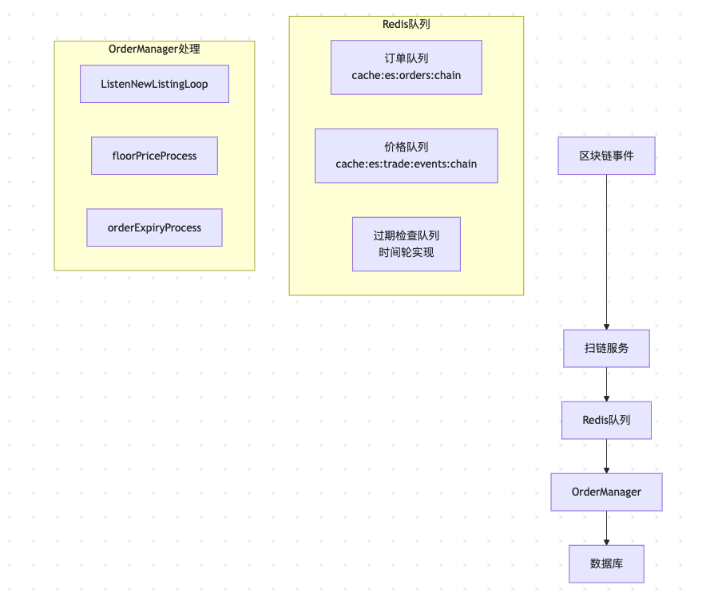
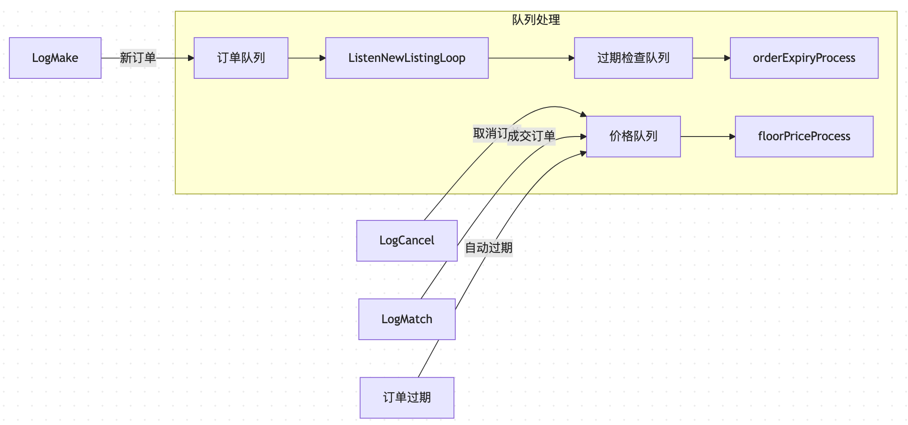
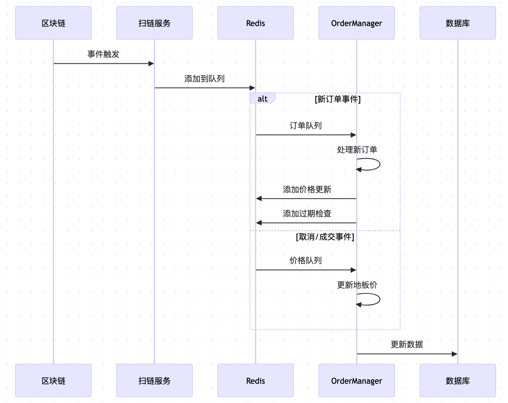

# 队列与事件关系流程图

## 1. 整体架构图

## 2. 事件类型与队列映射

## 3. 队列处理流程

## 4. 关键队列说明

### 4.1 订单队列
- Key格式：`cache:es:orders:{chain}`
- 数据类型：List
- 处理函数：`ListenNewListingLoop`
- 用途：处理新订单事件

### 4.2 价格队列
- Key格式：`cache:es:trade:events:{chain}`
- 数据类型：List
- 处理函数：`floorPriceProcess`
- 用途：更新地板价

### 4.3 过期检查队列
- 实现方式：时间轮
- 处理函数：`orderExpiryProcess`
- 用途：检查订单过期

## 5. 数据流转特点

1. **单向流动**：事件从区块链流向数据库，不会回流
2. **异步处理**：通过队列实现异步，提高系统性能
3. **解耦设计**：各组件通过队列解耦，便于维护
4. **可靠保证**：Redis队列确保事件不丢失
5. **链隔离**：不同链使用独立队列，互不影响