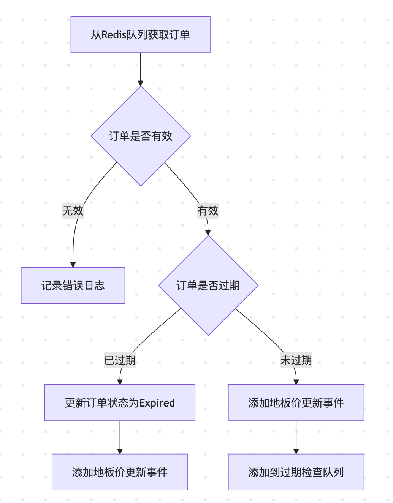

- [ListenNewListingLoop 业务执行流程分析](#listennewlistingloop-业务执行流程分析)
	- [1. 整体流程概览](#1-整体流程概览)
	- [2. 详细执行步骤](#2-详细执行步骤)
		- [2.1 从Redis队列获取订单](#21-从redis队列获取订单)
		- [2.2 订单数据解析](#22-订单数据解析)
		- [2.3 订单有效性检查](#23-订单有效性检查)
		- [2.4 订单过期处理](#24-订单过期处理)
		- [2.5 未过期订单处理](#25-未过期订单处理)
	- [3. 关键特性](#3-关键特性)

# ListenNewListingLoop 业务执行流程分析

## 1. 整体流程概览


## 2. 详细执行步骤

### 2.1 从Redis队列获取订单
```go
key := GenOrdersCacheKey(om.chain)
result, err := om.Xkv.Lpop(key)
```
- 生成队列key：`cache:es:orders:{chain}`
- 从队列左侧弹出一条订单数据
- 处理异常情况：
  - 如果队列为空(redis.Nil)或出错，等待1秒后重试
  - 其他错误记录警告日志

### 2.2 订单数据解析
```go
var listing ListingInfo
if err := json.Unmarshal([]byte(result), &listing); err != nil {
    xzap.WithContext(om.Ctx).Warn("failed on Unmarshal order info", zap.Error(err))
    continue
}
```
- 将JSON数据反序列化为ListingInfo结构
- 包含字段：
  - ExpireIn: 过期时间戳
  - OrderId: 订单ID
  - CollectionAddr: 合约地址
  - TokenID: NFT ID
  - Price: 价格
  - Maker: 卖家地址

### 2.3 订单有效性检查
```go
if listing.OrderId == "" {
    xzap.WithContext(om.Ctx).Error("invalid null order id")
    continue
}
```
- 验证订单ID非空
- 无效订单记录错误日志并跳过

### 2.4 订单过期处理
```go
if listing.ExpireIn < time.Now().Unix() { // 订单已过期
    // 1. 记录过期日志
    xzap.WithContext(om.Ctx).Info("expired activity order", zap.String("order_id", listing.OrderId))
    
    // 2. 更新订单状态
    om.updateOrdersStatus(listing.OrderId, multi.OrderStatusExpired)
    
    // 3. 添加地板价更新事件
    om.addUpdateFloorPriceEvent(&TradeEvent{
        EventType:      Expired,
        CollectionAddr: listing.CollectionAddr,
        TokenID:        listing.TokenID,
        OrderId:        listing.OrderId,
        From:           listing.Maker,
    })
}
```

### 2.5 未过期订单处理
```go
else { // 订单未过期
    // 1. 添加地板价更新事件
    om.addUpdateFloorPriceEvent(&TradeEvent{
        EventType:      Listing,
        CollectionAddr: listing.CollectionAddr,
        TokenID:        listing.TokenID,
        OrderId:        listing.OrderId,
        Price:          listing.Price,
        From:           listing.Maker,
    })
    
    // 2. 计算剩余过期时间
    delaySeconds := listing.ExpireIn - time.Now().Unix()
    
    // 3. 添加到过期检查队列
    om.addToOrderExpiryCheckQueue(delaySeconds, om.chain, listing.OrderId, listing.CollectionAddr)
}
```

## 3. 关键特性

1. **容错处理**：
   - Redis操作异常处理
   - JSON解析错误处理
   - 订单数据有效性检查

2. **状态管理**：
   - 过期订单状态更新
   - 地板价事件触发
   - 过期时间轮管理

3. **日志记录**：
   - 记录关键操作日志
   - 记录错误信息
   - 便于问题追踪

4. **性能考虑**：
   - 使用Redis队列实现异步处理
   - 避免阻塞主流程
   - 支持高并发场景

这个流程确保了订单的可靠处理，无论是过期还是未过期的订单都能得到正确处理，并触发相应的后续操作。