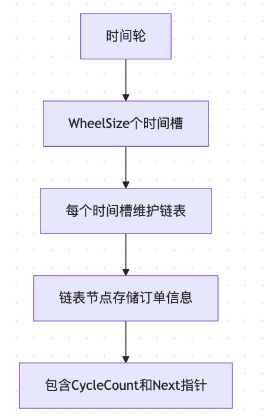

- [orderExpiryProcess 时间片应用详解](#orderexpiryprocess-时间片应用详解)
  - [1. 时间轮基础结构](#1-时间轮基础结构)
  - [2. orderExpiryProcess 逐行解析](#2-orderexpiryprocess-逐行解析)
    - [2.1 初始化保护机制](#21-初始化保护机制)
    - [2.2 启动时加载订单](#22-启动时加载订单)
    - [2.3 主循环结构](#23-主循环结构)
    - [2.4 时间轮索引管理](#24-时间轮索引管理)
    - [2.5 任务链表处理](#25-任务链表处理)
    - [2.6 任务分类处理](#26-任务分类处理)
  - [3. 时间轮关键特性](#3-时间轮关键特性)
    - [3.1 性能优化](#31-性能优化)
    - [3.2 并发安全](#32-并发安全)
    - [3.3 容错机制](#33-容错机制)
  - [4. 订单生命周期](#4-订单生命周期)
  - [5. 关键设计决策](#5-关键设计决策)
- [orderExpiryProcess的槽位处理机制](#orderexpiryprocess的槽位处理机制)
  - [1. 核心答案](#1-核心答案)
  - [2. 处理机制详解](#2-处理机制详解)
    - [2.1 单槽位处理流程](#21-单槽位处理流程)
    - [2.2 时间轮索引管理](#22-时间轮索引管理)
    - [2.3 槽位内任务处理](#23-槽位内任务处理)
  - [3. 设计优势](#3-设计优势)


# orderExpiryProcess 时间片应用详解

## 1. 时间轮基础结构



## 2. orderExpiryProcess 逐行解析

### 2.1 初始化保护机制
```go
defer func() {
    if r := recover(); r != nil {
        xzap.WithContext(om.Ctx).Error("[Order Manage] dq process recovered: " + fmt.Sprintf("%v", r))
    }
}()
```
- **目的**: 防止panic导致主协程崩溃
- **机制**: 使用defer捕获panic并记录日志
- **重要性**: 保证服务稳定性

### 2.2 启动时加载订单
```go
if err := om.loadOrdersToQueue(); err != nil {
    xzap.WithContext(om.Ctx).Error("[Order Manage] load orders to queue", zap.Error(err))
    return
}
```
- **功能**: 从数据库加载所有活跃订单
- **处理逻辑**:
  - 已过期订单: 直接更新状态
  - 未过期订单: 加入时间轮队列

### 2.3 主循环结构
```go
for {
    select {
    case <-time.After(time.Second * 1):
```
- **循环周期**: 每秒执行一次
- **实现方式**: 使用select和time.After
- **优势**: 避免CPU空转

### 2.4 时间轮索引管理
```go
if om.CurrentIndex >= WheelSize {
    om.CurrentIndex = om.CurrentIndex % WheelSize
}
```
- **目的**: 处理索引越界
- **机制**: 取模运算实现循环
- **效果**: 保持时间轮连续运行

### 2.5 任务链表处理
```go
taskLinkHead := om.TimeWheel[om.CurrentIndex].NotifyActivities
headIndex := om.CurrentIndex
om.CurrentIndex++

prev := taskLinkHead
p := taskLinkHead
```
- **数据结构**: 双指针遍历链表
- **指针作用**:
  - prev: 维护链表结构
  - p: 遍历当前节点

### 2.6 任务分类处理
```go
if p.CycleCount == 0 {
    // 处理过期任务
    go func(chain string, orderId string, collectionAddr string) {
        if err := om.updateOrderState(orderId, collectionAddr); err != nil {
            xzap.WithContext(om.Ctx).Error("failed on update order status", zap.Error(err))
        }
    }(p.ChainSuffix, p.orderID, p.CollectionAddr)
```
- **判断条件**: CycleCount为0表示到期
- **处理方式**: 
  - 异步更新订单状态
  - 避免阻塞主循环

```go
    // 从链表删除节点
    if prev == p {
        om.TimeWheel[headIndex].NotifyActivities = p.Next
        prev = p.Next
        p = p.Next
    } else {
        prev.Next = p.Next
        p = p.Next
    }
```
- **删除逻辑**:
  - 头节点: 更新链表头
  - 中间节点: 维护链表连接

```go
} else {
    // 更新未到期任务
    p.CycleCount--
    prev = p
    p = p.Next
}
```
- **未到期处理**:
  - 圈数递减
  - 继续等待下次检查

## 3. 时间轮关键特性

### 3.1 性能优化
- 减少定时器数量
- 链表管理任务
- 批量处理过期任务

### 3.2 并发安全
- 使用锁保护共享数据
- 异步处理避免阻塞
- 原子操作更新状态

### 3.3 容错机制
- panic恢复保护
- 错误日志记录
- 优雅降级处理

## 4. 订单生命周期


## 5. 关键设计决策

1. **时间轮大小**: 固定WheelSize个时间槽
2. **任务存储**: 链表结构便于增删
3. **过期处理**: 异步避免阻塞
4. **状态更新**: 事务保证一致性
5. **错误处理**: 完善的日志和恢复机制


# orderExpiryProcess的槽位处理机制

## 1. 核心答案

> orderExpiryProcess每次循环只处理一个槽位的数据。这是通过时间轮的索引递增机制实现的。

## 2. 处理机制详解

### 2.1 单槽位处理流程
```go
// 获取当前时间槽的任务链表头
taskLinkHead := om.TimeWheel[om.CurrentIndex].NotifyActivities
headIndex := om.CurrentIndex
om.CurrentIndex++  // 移动到下一个槽位
```

### 2.2 时间轮索引管理
```go
if om.CurrentIndex >= WheelSize {
    om.CurrentIndex = om.CurrentIndex % WheelSize
}
```
- 通过取模运算实现循环
- 确保索引始终在有效范围内
- 每秒处理一个槽位，3600秒完成一轮

### 2.3 槽位内任务处理
```go
for p != nil {
    if p.CycleCount == 0 {
        // 处理过期任务
        go om.updateOrderState(p.orderID, p.CollectionAddr)
        // 从链表删除节点
    } else {
        // 未过期，圈数减1
        p.CycleCount--
    }
}
```

## 3. 设计优势

1. **性能优化**：
   - 避免一次性处理大量任务
   - 分散处理压力，提高响应速度

2. **精确控制**：
   - 每秒处理一个槽位
   - 通过CycleCount实现多轮等待

3. **资源利用**：
   - 减少定时器数量
   - 避免CPU空转

这种设计确保了订单过期处理的有序性和高效性，是处理大规模订单过期场景的理想方案。