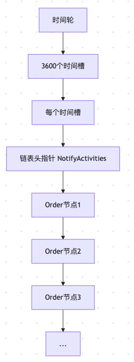
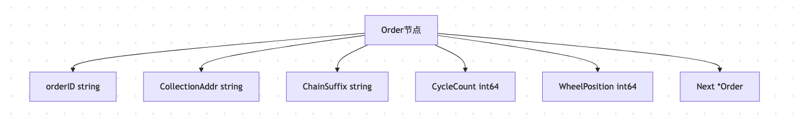
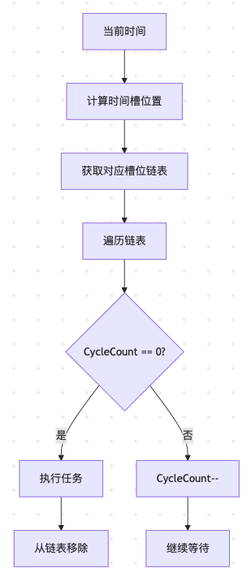
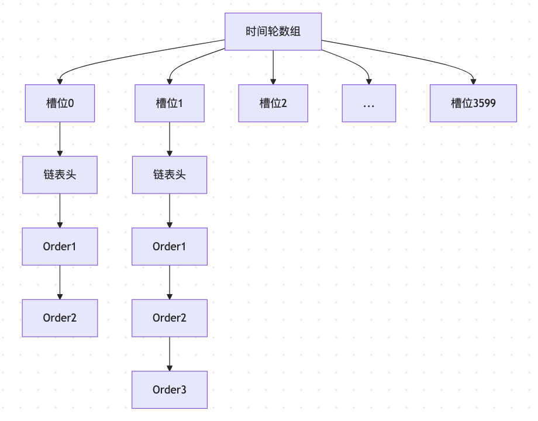
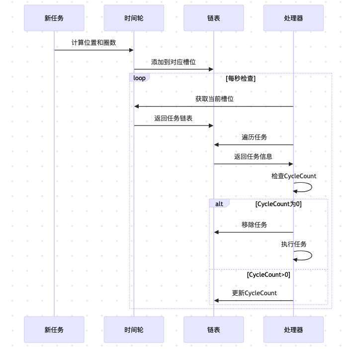

- [时间轮数据存储内存模型图](#时间轮数据存储内存模型图)
	- [1. 整体结构图](#1-整体结构图)
	- [2. Order节点结构](#2-order节点结构)
	- [3. 时间轮工作原理](#3-时间轮工作原理)
	- [4. 内存布局示例](#4-内存布局示例)
	- [5. 关键特性说明](#5-关键特性说明)
	- [6. 数据流转过程](#6-数据流转过程)
- [CycleCount的计算与意义](#cyclecount的计算与意义)
	- [1. CycleCount计算逻辑](#1-cyclecount计算逻辑)
		- [1.1 计算公式](#11-计算公式)
		- [1.2 计算步骤](#12-计算步骤)
	- [2. CycleCount的意义](#2-cyclecount的意义)
		- [2.1 核心作用](#21-核心作用)
		- [2.2 工作机制](#22-工作机制)
	- [3. 实际示例](#3-实际示例)
		- [3.1 示例场景](#31-示例场景)
		- [3.2 计算过程](#32-计算过程)
		- [3.3 结果分析](#33-结果分析)
		- [3.4 执行流程](#34-执行流程)
	- [4. 优势总结](#4-优势总结)
- [如果 calculateValue = 1000 + 200 = 1200，是个怎么执行流程？](#如果-calculatevalue--1000--200--1200是个怎么执行流程)
	- [1. 计算过程](#1-计算过程)
	- [2. 执行流程](#2-执行流程)
	- [3. 处理特点](#3-处理特点)


# 时间轮数据存储内存模型图

## 1. 整体结构图



## 2. Order节点结构



## 3. 时间轮工作原理



## 4. 内存布局示例



## 5. 关键特性说明

1. **时间轮大小**: 固定3600个槽位，代表1小时
2. **链表结构**: 每个槽位维护一个Order链表
3. **循环计数**: CycleCount记录任务需要等待的圈数
4. **位置计算**: WheelPosition记录任务在时间轮上的位置
5. **链表指针**: Next指针连接同一槽位的多个任务

## 6. 数据流转过程



这个内存模型设计实现了高效的定时任务管理，通过时间轮和链表的结合，能够有效处理大量订单的过期检查。


# CycleCount的计算与意义

## 1. CycleCount计算逻辑

### 1.1 计算公式
```go
// 计算订单最终的时间轮位置
calculateValue := om.CurrentIndex + delaySeconds
// 计算需要循环的圈数
cycle := calculateValue / WheelSize
if cycle > 0 {
    cycle--
}
```

### 1.2 计算步骤
1. 计算目标位置：当前索引 + 延迟秒数
2. 计算完整圈数：目标位置 / 时间轮大小(3600)
3. 圈数修正：如果存在完整圈数，则减1（因为从0开始计数）

## 2. CycleCount的意义

### 2.1 核心作用
- **记录剩余等待圈数**：表示任务还需要等待多少个完整的时间轮周期
- **优化性能**：避免为每个订单创建单独的定时器
- **精确控制**：配合WheelPosition实现秒级精度的任务调度

### 2.2 工作机制
- 每秒检查一次时间轮
- 每检查一次，CycleCount减1
- 当CycleCount为0时，表示任务到期

## 3. 实际示例

### 3.1 示例场景
假设：
- 当前时间轮索引(CurrentIndex) = 1000
- 订单有效期 = 7200秒（2小时）
- 时间轮大小(WheelSize) = 3600

### 3.2 计算过程
```go
// 1. 计算目标位置
calculateValue = 1000 + 7200 = 8200

// 2. 计算圈数
cycle = 8200 / 3600 = 2
if cycle > 0 {
    cycle--  // cycle = 1
}

// 3. 计算实际位置
index = 8200 % 3600 = 1000
```

### 3.3 结果分析
- CycleCount = 1（需要等待1个完整周期）
- WheelPosition = 1000（在时间轮上的位置）
- 订单将在1小时后（3600秒）到达指定位置
- 再过1小时（3600秒）后，CycleCount变为0，订单到期

### 3.4 执行流程
1. 第1小时：时间轮转一圈，CycleCount从1变为0
2. 第2小时：到达指定位置，执行过期处理

## 4. 优势总结

1. **内存效率**：只需存储圈数，不需要为每个订单创建定时器
2. **时间精度**：通过位置和圈数组合，实现精确到秒的调度
3. **性能优化**：单线程轮询，避免大量定时器的系统开销
4. **可扩展性**：支持任意长度的订单有效期，通过圈数来控制

这种设计使得系统能够高效地管理大量订单的生命周期，是处理订单过期场景的理想方案。

# 如果 calculateValue = 1000 + 200 = 1200，是个怎么执行流程？


calculateValue = 1200 的执行流程分析

## 1. 计算过程
```go
// 1. 计算目标位置
calculateValue := om.CurrentIndex + delaySeconds  // 1000 + 200 = 1200

// 2. 计算圈数
cycle := calculateValue / WheelSize  // 1200 / 3600 = 0
if cycle > 0 {
    cycle--  // 不执行，因为cycle = 0
}

// 3. 计算实际位置
index := calculateValue % WheelSize  // 1200 % 3600 = 1200
```

## 2. 执行流程
1. **订单定位**：
   - 当前索引：1000
   - 延迟时间：200秒
   - 目标位置：1200

2. **圈数判断**：
   - 计算结果：1200/3600 = 0
   - CycleCount = 0（不需要循环）

3. **时间轮位置**：
   - 最终位置：1200
   - 直接插入到TimeWheel[1200]槽位

## 3. 处理特点
- **无需循环**：因为目标位置在当前轮次内
- **直接定位**：订单将在200秒后被处理
- **简单插入**：不需要考虑多轮循环的情况

这种情况下，订单将在200秒后被直接处理，是最简单的时间轮使用场景。